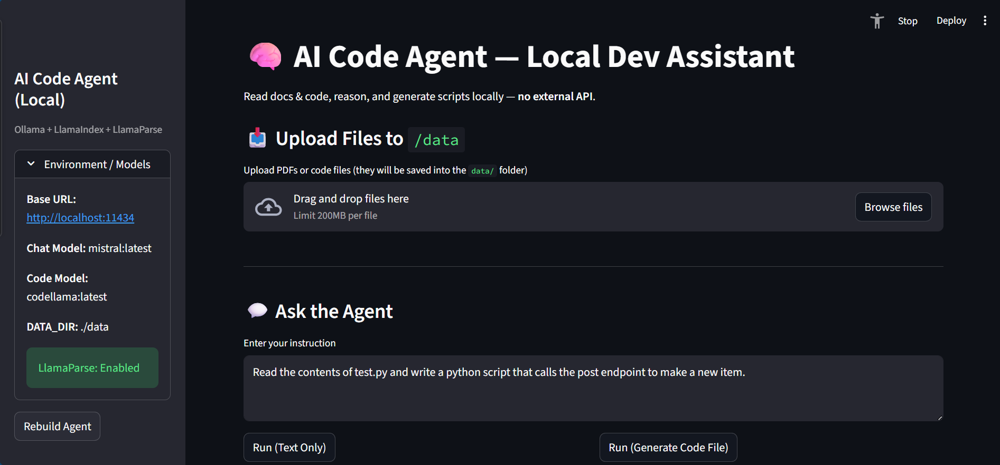
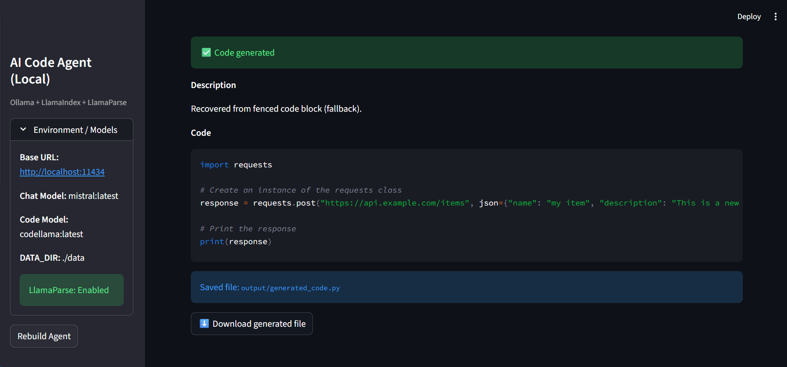

# 🧠 AI Code Agent — Local Dev Assistant

> A modular,  Generative AI code agent that reads, understands, and generates code using **Ollama**, **LlamaIndex**, and **LlamaParse** — all running locally.

---

## 📸 Project Overview

### Streamlit Web App



### Generated Output Example



---

## 🚀 About the Project

The **AI Code Agent** is a local Generative AI system capable of:

* Reading and analyzing documentation or code files
* Using tools (`code_reader`, `api_documentation`) to extract context
* Generating and structuring new code
* Operating **entirely offline** through local Ollama LLMs

It was developed for the **Global AI Hub – Generative AI Bootcamp 2025**, combining both **RAG (Retrieval-Augmented Generation)** and **Agentic reasoning**.

---

## 🧩 Modular Architecture

The project is now fully modular and organized as follows:

```
ai-code-agent/
├── app/
│   └── streamlit_app.py         # Streamlit-based web UI
├── src/
│   ├── agents/
│   │   └── ai_code_agent.py     # Core agent class (LLMs, tools, RAG)
│   ├── services/
│   │   ├── ollama_utils.py      # Health check & warm-up
│   │   ├── rag.py               # Document parsing and vector indexing
│   │   └── structuring.py       # Pydantic schema + JSON pipeline
│   ├── tools/
│   │   └── code_reader.py       # FunctionTool for reading local code files
│   ├── config.py                # Centralized environment configuration
│   └── prompts.py               # Agent context and JSON schema templates
├── data/                        # Input documents or code
├── output/                      # Generated scripts
├── main.py                      # CLI runner (new modular version)
├── requirements.txt
├── .env.example
└── README.md
```

---

## 🔐 Environment Configuration

1. Copy the example environment file and edit it:

   ```bash
   cp .env.example .env
   ```

2. Obtain a **LlamaCloud API key** by creating an account at
   [https://cloud.llamaindex.ai](https://cloud.llamaindex.ai)

3. Paste your key into `.env`:

   ```env
   LLAMA_CLOUD_API_KEY=your_llamacloud_api_key_here
   ```

> This key allows **LlamaParse** to process PDFs and extract structured text.
> Without it, the agent falls back to a default document reader.

---

## ⚙️ Installation & Setup

### 1️⃣ Clone the repository

```bash
git clone https://github.com/yourusername/ai-code-agent.git
cd ai-code-agent
```

### 2️⃣ Create a virtual environment

Using **uv** (recommended):

```bash
uv sync
```

or classic `venv`:

```bash
python -m venv venv
source venv/bin/activate     # Windows: venv\Scripts\activate
pip install -r requirements.txt
```

### 3️⃣ Configure environment

Follow the previous step to fill `.env` with your Ollama models and (optional) LlamaCloud key.

### 4️⃣ Pull Ollama models

```bash
ollama pull mistral:latest
ollama pull codellama:latest
```

### 5️⃣ Start Ollama

```bash
ollama serve
```

---

## 🖥️ Running the Agent

### 🧠 **Option 1: Streamlit Web App**

Launch the interactive dashboard:

```bash
uv run streamlit run app/streamlit_app.py
```

Then open [http://localhost:8501](http://localhost:8501) in your browser.

From the UI, you can:

* Upload files to `/data`
* Query the agent
* Generate structured Python files
* Download code outputs directly from `/output`

---

### 💻 **Option 2: CLI Mode**

Run directly in the terminal (no Streamlit needed):

```bash
uv run python main.py
```

Choose between:

* **Plain text mode** → short, descriptive answers
* **Structured mode** → generates and saves code files

---

## 📟 Example CLI Session

Below is a real interaction captured during testing.
It demonstrates the agent reading `test.py` and generating a new Python script that calls the POST endpoint:

```
Enter a prompt (Press q to quit): Read the contents of test.py and write a python script that calls the post endpoint to make a new item.
Mode: [p]lain text / [s]tructured file output ? [p/s]: s
Thought: The current language of the user is: English. I need to use a tool to help me answer the question.
Action: code_reader
Action Input: {'file_name': 'test.py'}
Observation: {'file_content': 'from flask import Flask, request, jsonify
...
if __name__ == "__main__":
    app.run(debug=True)
'}
Thought: I can answer without using any more tools. I'll use the user's language to answer.
Answer: To write a Python script that calls the POST endpoint to make a new item, you can follow these steps:

1. Import the necessary libraries ...
2. ...
10. Run the Flask app using the debug mode for simplicity.

Here's an example of what your script could look like:
```

from flask import Flask, request, jsonify
...
if **name** == "**main**":
app.run(debug=True)

```

✅ Code generated  
Description: Recovered from fenced code block (fallback).

💾 Saved file: output/generated_code.py
```

---

## 🧱 Features

| Feature                   | Description                                                      |
| ------------------------- | ---------------------------------------------------------------- |
| 💬 ReAct Agent            | Step-by-step reasoning (Thought → Action → Observation → Answer) |
| 🧠 RAG with LlamaIndex    | Reads and indexes local API docs or code                         |
| 🧩 Modular Tools          | `code_reader`, `api_documentation`                               |
| 🖥️ Streamlit UI          | Upload, query, and download code visually                        |
| ⚙️ CLI Mode               | Lightweight text or structured file output                       |
| 🔐 Privacy                | 100% local execution with Ollama                                 |
| 🧰 LlamaParse Integration | Structured PDF parsing with LlamaCloud API key                   |

---

## 🧰 Example Usage Summary

| Mode                | Command                                                                       | Output                            |
| ------------------- | ----------------------------------------------------------------------------- | --------------------------------- |
| Streamlit UI        | `uv run streamlit run app/streamlit_app.py`                                   | Interactive web dashboard         |
| CLI Text Mode       | `uv run python main.py --mode plain --prompt "Explain test.py"`               | Raw reasoning text                |
| CLI Structured Mode | `uv run python main.py --mode structured --prompt "Generate client for POST"` | Saves Python file under `/output` |

---

## 🧠 Developer Notes

* The agent’s reasoning, tool calls, and outputs are logged transparently.
* LlamaIndex orchestrates the flow; Ollama handles model inference.
* The modular `src/` layout supports easy extension — add new tools under `src/tools/`.

Future enhancements might include:

* 🧩 **Code Writer Tool** (automatic saving & diffing)
* 🌐 **Web Fetch Tool** (for online doc retrieval)
* 🪶 **Memory Module** (persistent multi-turn reasoning)

---

## 🧩 Credits

Developed by **Muhammed Musab Kaya**
as part of the **Global AI Hub – Generative AI Bootcamp 2025**

---

## 📜 License

This project is released under the **MIT License**.
Feel free to use, modify, and improve it — contributions are welcome!

---